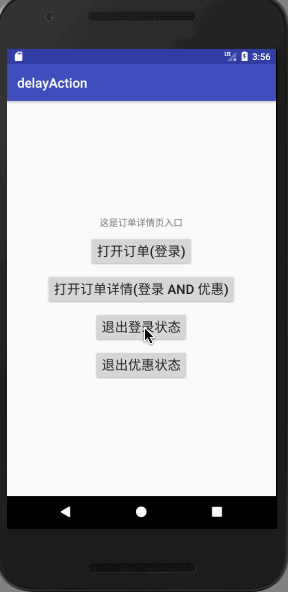
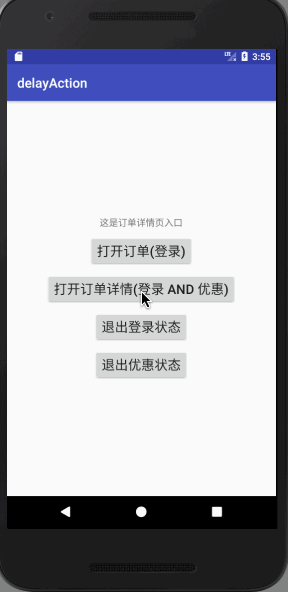

### 如何延迟执行目标行为

例如我们有时候会有这样的需求，那就是在执行目标行为时候，需要执行前置的一些行为。而这些前置行为，需要用户参与才能完成，或者这些前置
行为要跳转到另外一个未知上下文中执行。

典型应用场景：


那么我们如何实现这种需求呢？请教参我的博客分析[android 登录成功后再跳转到目标界面的思考](http://www.jianshu.com/p/1d0180ec64fb)


### 添加依赖

```
compile 'com.abbott.delayaction:delayaction:1.0.0'
```


### 1、基本执行流程图如下


### 2、演示图如下

只需要进行登录的验证



需同时进行登录和优惠券的验证



### 3、代码调用如下

调用目标方法
```

 SingleCall.getInstance()
                        .addAction(MainActivity.this)
                        .addValid(new LoginValid(MainActivity.this))
                        .addValid(new DiscountValid(MainActivity.this))
                        .doCall();

```

完成valid检验后，再执行即可。
```
SingleCall.getInstance().doCall();

```

当然每个对应的验证模型需要自己去完成，例如LoginValid的模型

```
package com.goodluck.abbott.valid;

import android.app.Activity;
import android.content.Context;

import com.goodluck.abbott.LoginActivity;
import com.goodluck.abbott.UserConfigCache;
import com.toptechs.libaction.action.Valid;

/**
 * Created by jinyabo on 8/12/2017.
 */

public class LoginValid implements Valid {
    private Context context;

    public LoginValid(Context context) {
        this.context = context;
    }

    /**
     * check whether it login in or not
     * @return
     */
    @Override
    public boolean check() {
        return UserConfigCache.isLogin(context);
    }


    /**
     * if check() return false. then doValid was called
     */
    @Override
    public void doValid() {
         LoginActivity.start((Activity) context);
    }
}
```


